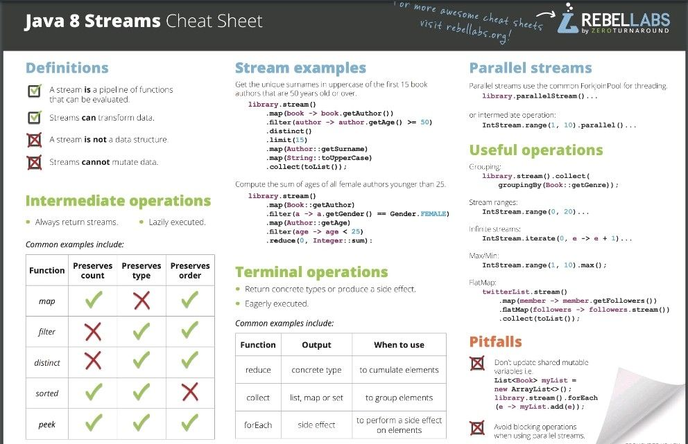

# java-8-streams-cheat
L'API Stream facilite l'exécution de traitements sur des données de manière séquentielle ou parallèle. Les Streams permettent de laisser le développeur se concentrer sur les données et les traitements réalisés sur cet ensemble de données sans avoir à se préoccuper de détails techniques de bas niveau comme l'itération sur chacun des éléments ou la possibilité d'exécuter ces traitements de manière parallèle

